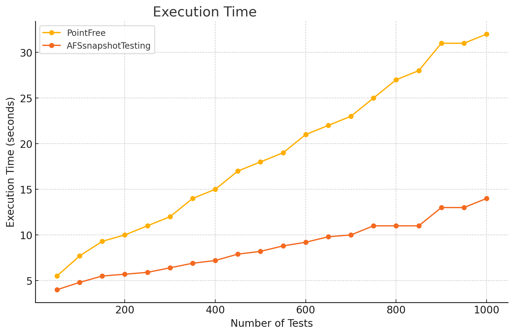

# AFSnapshotTesting
Is the world's [fastest library](#1-the-fastest-in-the-world) for creating snapshot tests of your visual components. Its main distinguishing feature is the use of Metal compute shaders to enable high-performance parallel `GPU` image analysis algorithms.

The library offers an alternative testing strategy, as outlined in [cluster analysis](#2-cluster-analysis) which includes a parallel implementation that provides a **200x speed** increase compared to traditional `CPU` implementations.
## Idea of ​​creation
The idea for the library came from my work on particle simulation using Apple Metal. By that time, I already had experience developing an internal corporate tool for snapshot testing and had a solid understanding of the operational features of existing open-source solutions, their technical limitations, and the problems they were designed to solve.

Having seen the impressive capabilities of Apple Metal for parallel processing of large volumes of data as particles and recognizing the potential to enhance existing approaches, a simple idea came to mind: to use pixels instead of particles.
## Example
```swift
import AFSnapshotTesting

class ExampleTests: XCTestCase {
    func testViewIphone14() {
        let view = View()
        assertSnapshot(view, on: .iPhone14)
    }

    func testViewSomeSize() {
        let view = View()
        assertSnapshot(
	        view,
            on: (size: CGSize(width: 100, height: 300), scale: 3)
        )
    }
}
```

By default, a naive comparison method . If you want to use a different comparison algorithm or adjust the parameters, you can configure them manually.

```swift
func testViewIphone14() {
    let view = View()
	assertSnapshot(
	    view, 
        on: .iPhone14, 
        as: .cluster(threshold: 3, clusterSize: 3)
    )
}
```
## Installation
### Swift Package Manager
```swift
dependencies: [
    .package(
        url: "https://github.com/afanasykoryakin/apple-metal-snapshot-testing",
        from: "1.0.0"
    )
]
```
## Features
1. **Automatic Difference Detection**  
   When a snapshot test fails, a `difference` image is automatically generated to highlight discrepancies. Use the color selection parameter to adjust the visual representation of differences between the reference and the actual snapshot. This makes it easy to identify changes.

   ```swift
   // Example usage
   assertSnapshot(..., differenceColor: .red)
   ```

2. **Customizable Pixel Tolerance**  
   Fine-tune your tests by setting a threshold for the allowable number of non-matching pixels. You can control pixel clusters' size and define tolerances to eliminate false positives caused by minor visual discrepancies. [new settings](#3-discrete-settings)

3. **Automatic Reference Creation**  
   When running tests for the first time, the library automatically creates reference images for future comparisons.

4. **Multiple Tests in a Single Test Case (using `named`)**  
   The `named` parameter allows you to run multiple snapshot tests within a single test case. This is useful for testing different states of a UI component, such as after a button press or other interactions, without needing to split them into separate test cases.

    ```swift
    func testInteraction() {
       // Example usage with `named`
	   assertSnapshot(view, named: "initialState")
	   // Simulate button press
	   assertSnapshot(view, named: "afterButtonPress")
    }
    ```

5. **Outlier Handling with Cluster Analysis**
    The library includes advanced algorithms like [[#2. Cluster analysis|cluster analysis]] for outlier detection and reduction of false positives. Instead of flagging every minor pixel difference, cluster analysis groups nearby pixel changes into clusters, allowing you to filter out small, random visual artifacts. This approach ensures that only significant changes are flagged, improving the accuracy and reliability of your tests.
## Distinctive Features
### 1. The fastest in the world
AFSnapshotTesting runs 1000 tests 2,286 times faster than pointFree [SnapshotTesting](https://github.com/pointfreeco/swift-snapshot-testing) v1.16.0.



#### 1.1 Testing Environment
The performance and accuracy of the tests were evaluated in a new SPM module, which includes dependencies on AFSnapshotTesting and  [SnapshotTesting](https://github.com/pointfreeco/swift-snapshot-testing) v1.16.0.
##### 1.1.1 Testing Environment
1. XCode 15.3 + Sumulator iOS;
2. Macbook Pro 14" 2021, Apple M1 PRO, 16GB;
3. MacOS Sonoma 14.1;

- Testing was conducted on a hot build.
- The test plan included parallel execution mode, with each test class containing 10 tests.
- `memcpu` optimizations were disabled in the source code of [SnapshotTesting](https://github.com/pointfreeco/swift-snapshot-testing) v1.16.0. (see. [1.1.3 Simulating Outliers](#113-simulating-outliers))
##### 1.1.2 Test Parameters
1. Creation of a graphical component with a resolution of 1170 × 2532, equivalent to the iPhone 14 screen;
2. Gradient setup;
3. For [SnapshotTesting](https://github.com/pointfreeco/swift-snapshot-testing) v1.16.0.  `perceptualPrecision: 0.99`;
4. For AFSnapshotTesting `СlusterStrategy`;
##### 1.1.3 Simulating Outliers
[SnapshotTesting](https://github.com/pointfreeco/swift-snapshot-testing) v1.16.0 includes optimization that allow bypassing comparison and outlier handling algorithms when they are not necessary. For the sake of experimentation, it was decided to modify the library's source code to disable these optimization.

In the file `UIImage.swift`, changes were made by commenting out lines 118 and 129 to exclude them from the compilation process:

```swift
if memcmp(oldData, newData, byteCount) == 0 { return nil }
```

The `memcmp` optimization quickly compares two memory blocks of the same length and returns 0 if they are identical. If the memory blocks of the reference snapshot and the render are exactly the same, the algorithms can be skipped.
### 2. Cluster analysis
Existing algorithms for minimizing the impact of outliers, primarily based on approaches similar to color blindness, are already quite fast. While a significant increase in speed is a welcome improvement, it is not critically important.

**The key achievement is the creation of a parallel algorithm for minimizing the impact of outliers on the GPU, based on the analysis of the size of [interconnected clusters](https://courses.cs.washington.edu/courses/cse576/book/ch3.pdf).**

By nature, outliers are usually isolated or form small clusters, which is significantly different from the differences caused by actual changes in development.

The idea of using cluster analysis is not entirely new. Existing approaches receive positive feedback as a method for minimizing outliers, but they are critically slow.

In traditional `CPU`-based implementations, it takes an average of 1 second to perform a single test. This means that running a thousand tests would take approximately 16.6 minutes. The parallel implementation on the `GPU` performs the same work in 5 seconds, which is 200 times faster.
#### Grouping Significant Changes
- The cluster analysis algorithm looks at a non-matching pixel and checks if it's isolated or part of a cluster. This helps determine whether the changes are part of a larger modification (such as a component redesign) or just random, isolated changes. In this way, cluster analysis helps identify the nature of UI changes and reduces the number of false test failures.

*P.S. Color blindness-based analysis is the industry standard, and not everyone may want to move away from it. The existing modular architecture allows for the creation of the CIED2000 color sensitivity algorithm as a separate testing strategy. Additionally, you can create combined algorithms that incorporate both color blindness analysis and cluster analysis, which will provide even greater accuracy and effectiveness.*
### 3. Discrete settings
**It allows you to fine-tune your tests and eliminates the need for magic coefficients like 0.999998...**
```swift
assertSnapshot(
	...
	as: .image(precision: 0.99998, perceptualPrecision: 0.98)
)
```
 **VS**
```swift
assertSnapshot(
	...
	as: .cluster(threshold: 3, clusterSize: 5)
)
```
`threshold` is the number of non-matching pixels included in a cluster, where the maximum size exceeds 5 pixels.
## Resume
Thank you. my [tg](https://t.me/ananasykor)
## License
License: MIT, https://github.com/afanasykoryakin/apple-metal-snapshot-testing/blob/master/LICENSE